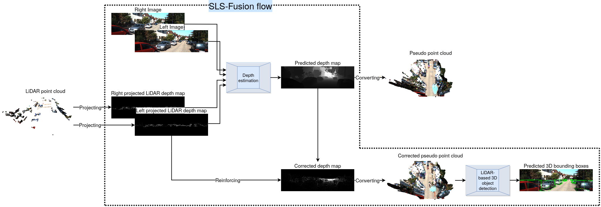
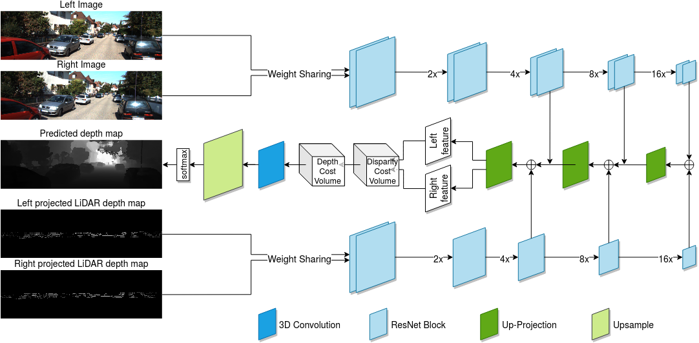
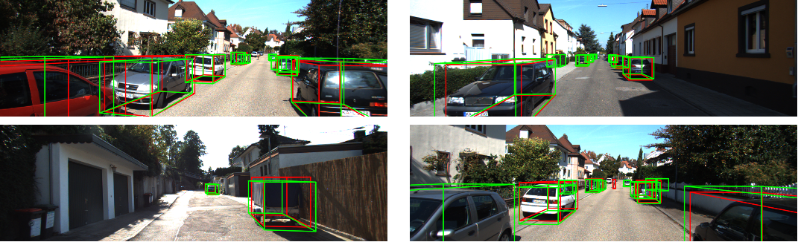

# SLS-Fusion

This repos is an official implementation of the paper [Sparse LiDAR and Stereo Fusion (SLS-Fusion) for Depth Estimation and 3D Object Detection](https://ieeexplore.ieee.org/document/9569023) accepted by ICPRS 2021.

By [Nguyen Anh Minh MAI*](https://maiminh1996.github.io/), [Pierre Duthon](https://www.researchgate.net/profile/Pierre_Duthon2), [Louahdi Khoudour](https://www.researchgate.net/profile/Louahdi_Khoudour), [Alain Crouzil](https://www.researchgate.net/profile/Alain_Crouzil), [Sergio A. Velastin](https://scholar.google.com/citations?user=FsE86kwAAAAJ&hl=en)

## Introduction

This work is based on our [paper](https://ieeexplore.ieee.org/document/9569023), which is published in ICPRS 2021. We proposed a novel 3D object detector taking stereo camera and LiDAR as input. You can also check our project webpage for a deeper introduction.

In this repository, we release code and data for training and testing our SLS-Fusion network on stereo camera and point clouds (64 beams and 4 beams).

## Abstract

Today, the popularity of self-driving cars is growing at an exponential rate and is starting to creep onto the roads of developing countries. For autonomous vehicles to function, one of the essential features that needs to be developed is the ability to perceive their surroundings. To do this, sensors such as cameras, LiDAR, or radar are integrated to collect raw data. The objective of this paper is to evaluate a fusion solution of cameras and LiDARs (4 and 64 beams) for 3D object detection in foggy weather conditions. The data from the two input sensors are fused and an analysis of the contribution of each sensor on its own is then performed. In our analysis, we calculate average precision using the popular KITTI dataset, on which we have applied different intensities of fog (on a dataset we have called Multifog KITTI). The main results observed are as follows. Performances with stereo camera and 4 or 64 beams LiDAR are high (90.15%, 89.26%). Performance of the 4 beams LiDAR alone decreases sharply in foggy weather conditions (13.43%). Performance when using only a camera-based model remains quite high (89.36%). In conclusion, stereo cameras on their own are capable of detecting 3D objects in foggy weather with high accuracy and their performance slightly improves when used in conjunction with LIDAR sensors.






## Requirements

python >= 3.6, torch 1.3.1, cuda 10.2

``` bash
$ pip install -r requirement.txt
```

## Datasets

Download [scenflow dataset](https://lmb.informatik.uni-freiburg.de/resources/datasets/SceneFlowDatasets.en.html) for pre-training and [KITTI dataset](http://www.cvlibs.net/datasets/kitti/eval_object.php?obj_benchmark=3d). And then, we setup as follows:
```txt
├── dataset
│   ├── kitti
│   │   ├── annotations
│   │   │   ├── data_object_training_annotations.json
│   │   │   ├── inference_annotations.json
│   │   │   ├── object_inference_annotations.json
│   │   │   ├── train_annotations.json
│   │   │   └── val_annotations.json
│   │   ├── ImageSets
│   │   │   ├── subval.txt
│   │   │   ├── test.txt
│   │   │   ├── train.txt
│   │   │   ├── trainval.txt
│   │   │   └── val.txt
│   │   ├── testing
│   │   │   ├── calib
│   │   │   ├── image_2
│   │   │   ├── image_3
│   │   │   └── velodyne
│   │   └── training
│   │   │   ├── calib
│   │   │   ├── image_2
│   │   │   ├── image_3
│   │   │   └── velodyne
│   └── sceneflow
│   │   │   ├── monkaa
|   │   │   │   ├── frames_cleanpass
|   │   │   │   └── disparity
│   │   │   ├── driving
|   │   │   │   ├── frames_cleanpass
|   │   │   │   └── disparity
│   │   │   └── flyingthing3d
|   │   │   │   ├── frames_cleanpass
|   │   │   │   └── disparity
```


## Training & Inference

1. Training on SceneFlow dataset

```bash
$ python training.py --config ../configs/sls_fusion_sceneflow.config
```

2. Training on KITTI dataset

SLS-Fusion (Cam+LiDAR)
```bash
$ python training.py --config ../configs/sls_fusion_kitti_od.config
```
SLS-Fusion (Cam)
```bash
$ python training.py --config ../configs/sls_fusion_kitti_od.config --generate cam
```
SLS-Fusion (LiDAR)
```bash
$ python training.py --config ../configs/sls_fusion_kitti_od.config --generate lidar
```

3. Generating pseudo point cloud

```bash
$ python training.py --config ../configs/generate_depth_map.config --generate_depth_map True
```

4. Correcting pseudo point cloud

```bash
$ python main_batch.py --input_path <path-to-generated-depthmap> \
    --calib_path <path-to-calib> \
    --gt_depthmap_path <path-to-gth-depthmap> \
    --output_path <path-to-save-output> \
    --threads 4 \
    --split_file ../../dataset/kitti/ImageSets/trainval.txt
```

5. Converting depth map into point cloud

Depth map to point cloud
```bash
$ python depthmap2ptc.py --output_path <path-to-save-output> \
    --input_path <path-to-depthmap> \
    --calib_path <path-to-calib> \
     --threads 4 \
    --split_file ../../dataset/kitti/ImageSets/trainval.txt
```
point cloud to depth map
```bash
$ python ptc2depthmap.py --output_path <path-to-save-output> \
    --input_path <path-to-depthmap> \
    --calib_path <path-to-calib> \
     --threads 4 \
    --split_file ../../dataset/kitti/ImageSets/trainval.txt
```

5. Sparsifying dense depth map into 64-beam point cloud

```bash
$ python kitti_sparsify.py --pl_path  <path-to-pseudo-lidar>  \
    --sparse_pl_path  <path-to-save-sparse-output>
```

6. Apllying LiDAR-based object detection

We can use any plug-and-play LiDAR-based 3D object detection on the obtained pseudo point cloud.

E.g. Using [PointRCNN](https://github.com/sshaoshuai/PointRCNN)

## Simulating point cloud (4, 8, 16, 32 beams)

or download from [Sparse LiDAR KITTI datasets](https://maiminh1996.github.io/publications/sparse_lidar_kitti_datasets.html)

## Example outputs



## Contact

Any feedback is very welcome! Please contact us at mainguyenanhminh1996@gmail.com

## Citation

If you find our work useful in your research, please consider citing:

```bib
@inproceedings{mai_sparse_2021,
    author = {Mai, Nguyen Anh Minh and Duthon, Pierre and Khoudour, Louahdi and Crouzil, Alain and Velastin, Sergio A.},
    title = {Sparse {LiDAR} and {Stereo} {Fusion} ({SLS}-{Fusion}) for {Depth} {Estimation} and {3D} {Object} {Detection}},
    booktitle = {Proceedings of the {International} {Conference} of {Pattern} {Recognition} {Systems} ({ICPRS})},
    volume = {2021},
    url = {https://ieeexplore.ieee.org/document/9569023},
    doi = {10.1049/icp.2021.1442},
    eprint = {2103.03977},
    archivePrefix={arXiv},
    year = {2021},
    pages = {150--156},
}
```

